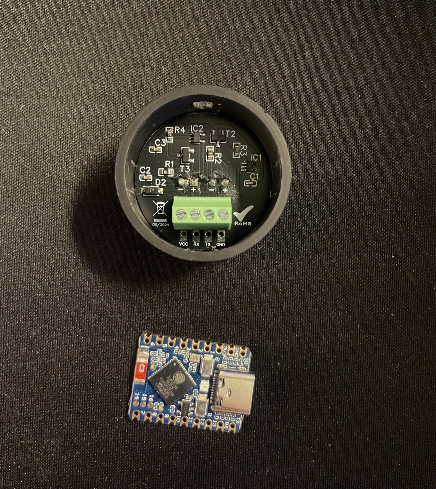

# ImSysLeser – iMSys-Stromzähler mit ESPHome in Home Assistant

Liest einen Stromzähler aus dem **intelligenten Messsystem (iMSys)** über seine optische
D0-Schnittstelle (SML) aus und stellt Zählerstände und aktuelle Leistung in Home Assistant bereit –
mit einem IR-Lesekopf und einem ESP32-S3 unter [ESPHome](https://esphome.io).
Eine RGB-LED auf dem Board zeigt an, ob Daten ankommen und ob die Verbindung steht.

## Hardware

| Teil | Typ |
|---|---|
| IR-Lesekopf | wispr WS-IR-UART/TTL (Platine 09/2024), 3–5 V, Schraubklemmen VCC / RX / TX / GND, Magnethalter – [Anleitung (PDF)](https://www.wispr-shop.de/wp-content/uploads/go-x/u/d72bb368-5d65-466c-976e-98594c2b7831/Gebrauchsanleitung-WS-IR-UART-TTL.pdf) |
| Controller | Waveshare ESP32-S3-Zero (ESP32-S3FH4R2: 4 MB Flash, 2 MB PSRAM), natives USB-C, Tasten BOOT und RESET, RGB-LED WS2812 an GPIO21 – [Wiki](https://www.waveshare.com/wiki/ESP32-S3-Zero) |
| Zähler | getestet mit einem Iskra-Zähler (Kennung `1ISK…`) im iMSys |

## Verdrahtung

| Lesekopf | ESP32-S3-Zero | Bemerkung |
|---|---|---|
| VCC | 3V3 | 3,3 V, damit der Signalpegel zum ESP32 passt (nicht 5 V) |
| GND | GND | |
| RX  | 1 (GPIO1) | RX am Kopf ist das **Lesesignal** – also *nicht* kreuzen |
| TX  | **am Kopf mit VCC brücken** | siehe unten |

3V3, GND und Pin 1 liegen auf dem Board nebeneinander (obere Reihe neben 5V).

> **Wichtig: TX am Lesekopf nicht offen lassen.**
> Ist der TX-Eingang des Kopfes unbeschaltet, leuchtet seine IR-Sendediode (durchsichtig, glimmt
> sichtbar rot) dauerhaft. Ihr Licht spiegelt sich im Zählerfenster und blendet den eigenen
> Fototransistor – es kommen keine Daten an. Eine kurze Drahtbrücke zwischen den Klemmen
> **TX und VCC** am Kopf legt den Eingang auf „High“ (UART-Ruhepegel), die Diode bleibt aus.
> Für SML wird nichts an den Zähler gesendet, TX wird also nicht gebraucht.

### Montage am Zähler

Kopf mit Kabelauslass nach **unten** magnetisch auf die D0-Schnittstelle setzen:
Fototransistor (dunkel) rechts, IR-LED (transparent) links.

## Installation

1. ESPHome-Add-on in Home Assistant öffnen, neues Gerät anlegen und den Inhalt von
   [`stromzaehler.yaml`](stromzaehler.yaml) übernehmen.
2. Die Einträge aus [`secrets.yaml.example`](secrets.yaml.example) in die ESPHome-`secrets.yaml`
   übernehmen (WLAN, API-Schlüssel, OTA- und Fallback-Passwort).
3. **Erstes Flashen per USB:** Taste **BOOT** gedrückt halten, dabei USB-C einstecken, loslassen.
   In ESPHome *Install → Plug into this computer* (Chrome/Edge, kein Treiber nötig).
   Danach einmal RESET drücken.
4. Das Gerät erscheint in Home Assistant unter *Einstellungen → Geräte & Dienste* → **Konfigurieren**.
5. Spätere Updates: *Install → Wirelessly*.

`compile_process_limit: 1` hält den Speicherbedarf beim Kompilieren klein – auf kleinen
Home-Assistant-Hosts beendet ein paralleler ESP-IDF-Build sonst gern andere Add-ons.
Wer genug RAM hat, kann die Zeile entfernen.

## Entitäten

| Entität | OBIS | Einheit / Verhalten |
|---|---|---|
| Bezug gesamt | 1-0:1.8.0 | kWh, höchstens 1× pro Minute und nur bei Änderung |
| Einspeisung gesamt | 1-0:2.8.0 | kWh, höchstens 1× pro Minute und nur bei Änderung |
| Leistung aktuell | 1-0:16.7.0 | W, bei jeder Änderung (etwa 1× pro Sekunde); **positiv = Bezug, negativ = Einspeisung** |
| Zählernummer | 1-0:96.1.0 | Server-ID nach DIN 43863-5 lesbar umgerechnet, z. B. `1ISK00…` (Diagnose) |
| WLAN-Signal, Laufzeit | – | Diagnose |

Die Zählerstände lassen sich direkt im **Energie-Dashboard** als Netzbezug und Netzeinspeisung
verwenden. Die Drosselung hält die Home-Assistant-Datenbank klein: grob 40.000 Einträge pro Tag,
fast alle von der Leistung.

Der getestete Iskra-Zähler sendet mit „Inf on“ genau fünf Werte: 96.50.1 (Hersteller), 96.1.0
(Server-ID), 1.8.0, 2.8.0 und 16.7.0 – Zählerstände mit 0,1 Wh Auflösung. Welche OBIS-Codes ein
anderer Zähler liefert, steht im ESPHome-Log bei jedem Telegramm unter `OBIS info:`; daraus lassen
sich weitere Sensoren ergänzen.

## Genauigkeit: Abgleich mit dem Wechselrichter

Zur Kontrolle wurden die Werte mit dem eigenen Netzzähler eines SolaX-Hybridwechselrichters
verglichen (Home-Assistant-Recorder, Wechselrichter wird alle 10 s abgefragt).

**Nacht, 23.09.2026, 1 h nur Bezug:** Mittel 754 W am Zähler gegenüber 756 W am Wechselrichter,
Energie 0,763 gegenüber 0,760 kWh.

**24.09.2026, 00:35–14:20, Bezug und Einspeisung (PV bis knapp 8 kW):**

| | ImSysLeser | Wechselrichter |
|---|---|---|
| Bezug | 3,192 kWh | 3,19 kWh |
| Einspeisung | 10,754 kWh | 10,76 kWh |
| größte Einspeiseleistung | −7922 W | 7919 W |

Die Stundenmittel der Leistung weichen meist um höchstens 10 W ab, maximal um 30 W (< 1 %).
Der Median der Abweichung der 5-Minuten-Mittel liegt bei 2,4 W.

Es gibt weder Skalierungsfehler noch Offset. Größere Abweichungen in einzelnen
5-Minuten-Fenstern (bis ~190 W) treten nur bei schnell wechselnder PV-Leistung auf: Der
Wechselrichter wird nur alle 10 s abgefragt und hinkt einige Sekunden hinterher, deshalb
fehlen ihm kurze Spitzen, die der Zähler im Sekundentakt erfasst. Die absoluten
Zählerstände beider Geräte unterscheiden sich, weil sie unterschiedlich lange zählen –
verglichen werden daher nur die Zuwächse.

Vorzeichen beachten: Der Zähler meldet Einspeisung **negativ**, der SolaX-Wechselrichter
(`measured_power`) positiv. Der Betrag stimmt überein.

## Status-LED

| Farbe | Bedeutung |
|---|---|
| blau | Zähler sendet gerade, Daten kommen an |
| grün | letztes Telegramm gültig empfangen, alles in Ordnung |
| gelb blinkend | WLAN oder Verbindung zu Home Assistant weg, Auslesen in Ordnung |
| lila blinkend | seit 60 s kein gültiges Telegramm (Kopf verrutscht, TX-Brücke fehlt, Prüfsummenfehler), Netzwerk in Ordnung |
| rot blinkend | beides gestört |

Im Normalbetrieb wechselt die LED im Takt des Zählers zwischen Blau und Grün. Helligkeit 10 %.
Sind Rot und Grün vertauscht, in der YAML `channel_colors: RGB` auf `GRB` ändern.
Die LED ist `internal` und erscheint nicht in Home Assistant.

## Fehlersuche

- **LED blinkt lila, keine Daten:** TX–VCC-Brücke am Kopf prüfen (siehe oben), dann Sitz und
  Ausrichtung des Kopfes. Im Log (*ESPHome → Logs*) muss regelmäßig `OBIS info:` erscheinen.
- **Zählerstand falsch skaliert:** mit dem Display vergleichen und `multiply` anpassen.
- **Keine Leistung (16.7.0) oder keine Nachkommastellen:** Viele Zähler geben diese erst nach
  Eingabe der Zähler-PIN frei (beim Messstellenbetreiber anfragen, mit Taschenlampe am Lichtsensor
  eingeben) und nach Einstellen von „Inf on“.
- **Flashen per USB klappt nicht:** BOOT beim Einstecken halten; ein USB-C-Datenkabel verwenden,
  kein reines Ladekabel.

## Lizenz

[MIT](LICENSE)
